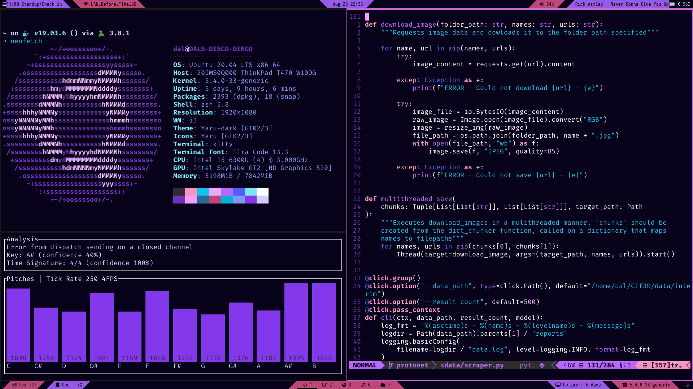

# Linux Setup
This repository tracks my Linux computing environment for super-quick setup on any Debian-based environment. It installs:

- wget & curl
- htop
- zsh
- oh my zsh
- Beautiful terminal pallettes
- .zshrc profile full of aliases, etc
- Pyenv

For arch-based systems, `manjaro_setup.sh` should work similarly, but ymmv. Has not been tested in quite awhile.

# Execution
Download, and run:

`chmod a+x ubuntu_setup.sh`

`sh ubuntu_setup.sh`

To make sure this worked sucessfully, try to open a new terminal and make sure it is a zsh shell. Also, run `pyenv global` to make sue your Python manaagement is working properly.

For i3 and other ricing stuff, just copy the .config to your home folder. I plan to add a polybar install script later, as it's quite involved. With i3 and polybar configured, it should look like this:

## Vim stuff
For the .vimrc to work, you'll need to make sure you have a full version of vim. For Debian-based systems:

`sudo apt remove --assume-yes vim-tiny`
`sudo apt-get update`
`sudo apt install --assume-yes vim`

Also make sure you have vundle:

`git clone https://github.com/gmarik/Vundle.vim.git ~/.vim/bundle/Vundle.vim`

Now just copy the .vimrc vile to your home folder, and run `:PluginInstall` inside of vim.

For YouCompleteMe, remember to run `install.py` inside of /.vim/plugged.

